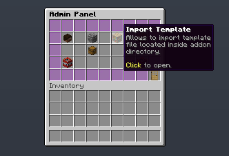
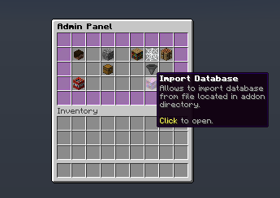
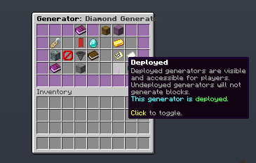

# MagicCobblestoneGenerator

**MagicCobblestoneGenerator** turns the plain and boring cobblestone generators to an awesome and reliable source of configurable blocks!

Created and maintained by [BONNe](https://github.com/BONNe).

{{ addon_description("MagicCobblestoneGenerator") }}

## Installation

1. Place the addon jar in the addons folder of the BentoBox plugin
2. Restart the server
3. Run the `/[admincmd] generator` command to configure the addon

## Configuration

By default, the addon tries to import all data from template file, to simplify first setup. A lot of addon settings are exposed in Admin GUI, however, some of them are not.
The latest config options, and their detailed explanations can be found [here](https://github.com/BentoBoxWorld/MagicCobblestoneGenerator/blob/develop/src/main/resources/config.yml).

Template file are mostly for users who do not like to use ingame editing GUI. However, template file is not automatically imported on each change. It requires importing via command or Admin GUI.

??? question "Template File Structure"
    ```
    # Start the listing of all generator tiers.
    tiers:
      # Unique Id for generator. Used in internal storage and accessing to each generator data.
      generator_unique_id: 
        # Display name for users. Supports colour codes.
        # Default value: generator_unique_id without _
        name: "Something fancy"
        # Description in lore message. Supports colour codes.
        # Can be defined empty by replacing eveything with [].
        # Default value: []
        description: -|
          First Line Of lore Message
          &2Second Line Of lore Message
        # Icon used in GUI's. Number at the end allows to specify stack size for item.
        # Default value: Paper.
        icon: "PAPER:1"
        # Generator type: COBBLESTONE, STONE or BASALT. Self explanatory.
        # Default value: COBBLESTONE
        type: COBBLESTONE
        # Indicates if genertor is default generator. Default generators ignores requirement section.
        # It is activated for each new island. Can be only one per each generator type.
        # Default value: false
        default: false
        # Users selects active generators.
        # Priority indicates which generator will be used
        # if multiple of them fulfills requirements.
        # Default value: 1
        priority: 1
        # There are several requirements that can be defined here.
        requirements:
          # Can define minimal island level for generator to work. Required Level Addon.
          # Default value: 0
          island-level: 10
          # List of required permissions for users to select this generator.
          # Default value: []
          required-permissions: []
          # List of required biomes for generator to work.
          # Empty means that there is no limitation in which biome generator works.
          # Default value: [].
          required-biomes: []
          # Cost for purchasing this generator. Requires Vault and any economy plugin.
          # Currently implemented by clicking on purchase icon in generator view GUI.
          # Default value: 0
          purchase-cost: 5.0
        # Cost for activating current generator tier. Requires Vault and any economy plugin.
        # Will be payed only on active switching between generators.
        # Default value: 0.
        activation-cost: 0.0
        # Materials and their chances. Use actual blocks please.
        # Chance supports any positive number, including double value.
        # Everything in the end will be normalized.
        # Default value: []
        blocks:
          FIRST_BLOCK_NAME_ID: NUMBER
          SECOND_BLOCK_NAME_ID: NUMBER
        # Treasure that has a chance to be dropped when block is generated.
        # ONLY on generation, not on block break.
        # Default value: []
        treasure:
          # Chance from 0 till 1. 0 - will not be possible to get a treasure.
          # Default value: 0
          chance: 0.001
          # Materials that can be dropped. Applies to the same rules as block section.
          # Default value: []
          material:
            FIRST_BLOCK_NAME_ID: NUMBER
            SECOND_BLOCK_NAME_ID: NUMBER
          # Maximal amount of items dropped.
          # It will be from 1 till defined amount.
          # Default value: 1
          amount: 1
    
    # Start the listing of all bundles
    bundles:
      # bundle_id
      bundle_unique_id:
        # Display name for users
        name: "Something fancy"
        # Description in lore message. Supports colour codes.
        # Can be defined empty by replacing eveything with [].
        # Default value: []
        description: -|
          First Line Of lore Message
          &2Second Line Of lore Message
        # Icon used in GUI's. Number at the end allows to specify stack size for item.
        # Default value: Paper.
        icon: "PAPER:1"
        # List of generators that bundle will work have access.
        generators:
          - generator_id_1
          - generator_id_2
    ```

## Commands

!!! tip
    `[player_command]` and `[admin_command]` are commands that differ depending on the gamemode you are running.
    The Gamemodes' `config.yml` file contains options that allows you to modify these values.
    As an example, on BSkyBlock, the default `[player_command]` is `island`, and the default `[admin_command]` is `bsbadmin`.
    Be aware, that this addon allows changing player commands aliases in addon `config.yml` file. 

=== "Player commands"
    - `/[player_command] generator`: Access to generator Selection GUI. 
    - `/[player_command] generator view <generator>`: Access to specific generator detailed view. 
    - `/[player_command] generator activate <generator> [false]`: Allows to activate (or deactivate) specific generator.
    - `/[player_command] generator buy <generator>`: Allows to buy specific generator.

=== "Admin commands"
    - `/[admin_command] generator`: Access to addon Admin GUI
    - `/[admin_command] generator import`: Imports default template file - `/plugins/BentoBox/addons/MagicCobblestoneGenerator/generatorTemplate.yml`.
    - `/[admin_command] generator database import <file>`: Ability to import database exported <file>.
    - `/[admin_command] generator database export <file>`: Ability to export database into <file> saved in `/plugins/BentoBox/addons/MagicCobblestoneGenerator/` folder.
    - `/[admin_command] generator why <player>`: A debugging command that allows finding issues with generators for each player.

## Permissions

!!! tip
    `[gamemode]` is a prefix that differs depending on the gamemode you are running.
    The prefix is the lowercased name of the gamemode, i.e. if you are using BSkyBlock, the prefix is `bskyblock`.
    Similarly, if you are using AcidIsland, the prefix is `acidisland`.

=== "Player permissions"
    - `[gamemode].stone-generator` - Let the player use the '/[player_command] generator' command and its subcommands.
    - `[gamemode].stone-generator.active-generators.3` - Sets the maximum number of active generators the island owner can have. 3 can be replaced with any positive integer. This is just an example.
    - `[gamemode].stone-generator.max-range.30` - Sets the maximum distance from the generator so it continues to work. 30 can be replaced with any positive integer. This is just an example.
    - `[gamemode].stone-generator.bundle.[bundle_id]` - Specifies which bundle will be used for user owned island.
    
=== "Admin permissions"
    - `[gamemode].admin.stone-generator` - Let the player use the '/[admin_command] generator' command and its subcommands.
    - `[gamemode].admin.stone-generator.why` - Let the player use a debug command '/[admin_command] why generator <player>'.
    - `[gamemode].admin.stone-generator.database` - Let the player use the '/[admin_command] generator database' command and its subcommands.
    
??? question "Something is missing?"
    You can find the comprehensive list of permissions in the [addon.yml](https://github.com/BentoBoxWorld/MagicCobblestoneGenerator/blob/develop/src/main/resources/addon.yml) file of this addon.  
    If something is indeed missing from the list below, please let us know!


## Placeholders

{{ placeholders_source(source="MagicCobblestoneGenerator") }}


## FAQ

??? question "Can you add a feature X?"
    Please add it to the list [here](https://github.com/BentoBoxWorld/MagicCobblestoneGenerator/issues).

??? question "How can I add a new generator tier?"
    Currently, addon supports 3 ways how to add a new generator:
    
    - By using ingame GUI that is available via `/[admin] generator` command.
    - By adding generator to a template file. 
    - By adding generator to the exported database file.

??? question "I added generator to the template/database file, but it does not shows up in game."
    For easier configuration with multiple gamemodes, generators are stored in the internal database. After editing template or database file, you need to import them into that memory. You can do it via Admin GUI by clicking on `Import Template` or `Import Database` buttons.
    
    {: loading=lazy }
    {: loading=lazy }

??? question "I have a generator that shows up in Admin GUI, but players do not see it."
    Most likely it is because of "deployment" status. To avoid with issues when players starts to activate generators while an admin is adding them, generators are undeployed and noone can use them. You can activate them by editing generator via Admin GUI and clicking on lever in Edit Generator GUI.
    {: loading=lazy }

??? question "What is treasures?"
    Treasures are things that are dropped uppon block generation. It allows to give an extra customization for each generator.

??? question "What is bundles?"
    Bundles is a feature that allows customizing experience for each island even more. If bundle is assigned to an island, then players on that island will be able to use only generators from that bundle. 

??? question "Can I disable showing required permissions in generator description?"
    Yes, addon provides a lot of customization options for displaying each generator. It is located in locales file:
    ```
          # Generator lore message generator. All elements in generator lore is generated
          # based on section below.
          generator:
            # Main lore element content. If you do not want to display treasures at all,
            # just remove them from [treasures] section.
            # [description] comes from each generator tier.
            # Lore does not supports colour codes. Each object separate supports.
            lore: |-
              [description]
              [blocks]
              [treasures]
              [type]
              [requirements]
              [status]
            # Generates [blocks] section
            blocks:
              # First line in blocks section. Empty line will not be displayed.
              title: "&7&l Blocks:"
              # Each block and its value under title. Cannot be empty.
              # Supports [number], [#.#], [#.##], [#.###], [#.####], [#.#####]
              value: "&8 [material] - [#.##]%"
            # Generates [treasures] section
            treasures:
              # First line in blocks section. Empty line will not be displayed.
              title: "&7&l Treasures:"
              # Each treasure and its value under title. Cannot be empty.
              # Supports [number], [#.#], [#.##], [#.###], [#.####], [#.#####]
              value: "&8 [material] - [#.####]%"
            # Generates [requirements] section
            requirements:
              # Allows to change order and content of requirements message.
              description: |-
                [biomes]
                [level]
                [missing-permissions]
              # Generates [level] message.
              level: "&c&l Required Level: &r&c [number]"
              # Generates [missing-permission] message title.
              permission-title: "&c&l Missing Permissions:"
              # Generates [missing-permission] message values.
              permission: "&c  -[permission]"
              # Generates [biomes] message title.
              biome-title: "&7&l Operates in:"
              # Generates [biomes] message values.
              biome: "&8 [biome]"
              # Generates [biomes] message for All Biomes.
              any: "&7&l Operates in &e&o all &r&7&l biomes"
            # Generates [status] section
            status:
              # Message that is showed for Locked generators.
              locked: "&c Locked!"
              # Message that is showed for generators that is not deployed.
              undeployed: "&c Not Deployed!"
              # Message that is showed for Active generators.
              active: "&2 Active"
              # Message that is showed for generators that required purchasing.
              purchase-cost: "&e Purchase Cost: $[number]"
              # Message that is showed for generators that has activation cost.
              activation-cost: "&e Activation Cost: $[number]"
            # Generates [type] section
            type:
              title: "&7&l Supports:"
              cobblestone: "&8 Cobblestone Generators"
              stone: "&8 Stone Generators"
              basalt: "&8 Basalt Generators"
              any: "&7&l Supports &e&o all &r&7&l generators"
    ```

## Translations

{{ translations(2972, ["de", "es", "lv", "zh-CN", "zh-TW", "fr", "ru", "pl", "tr", "vi"]) }}

## API

Since MagicCobblestoneGenerator 2.4.0 and BentoBox 1.17 other plugins can access to the MagicCobblestoneData addon data directly. However, addon requests are still a good solution for a plugins that do not want to use too many dependencies.

### Maven Dependency
MagicCobblestoneGenerator provides an API for other plugins. This covers version 2.5.0 and onwards.

!!! note
    Add the MagicCobblestoneGenerator dependency to your Maven POM.xml:

    ```xml
        <repositories>
            <repository>
                <id>codemc-repo</id>
                <url>https://repo.codemc.io/repository/maven-public/</url>
            </repository>
        </repositories>
        
        <dependencies>
            <dependency>
                <groupId>world.bentobox</groupId>
                <artifactId>magiccobblestonegenerator</artifactId>
                <version>2.5.0</version>
                <scope>provided</scope>
            </dependency>
        </dependencies>
    ```
Use the latest MagicCobblestoneGenerator version.

The JavaDocs for MagicCobblestoneGenerator can be found [here](https://ci.codemc.io/job/BentoBoxWorld/job/MagicCobblestoneGenerator/ws/target/apidocs/index.html).

### Events

=== "GeneratorActivationEvent"
    !!! summary "Description"
        Event that is triggered when player activates/deactivates a generator on their island.
        This event is cancellable.

        Link to the class: [GeneratorActivationEvent](https://github.com/BentoBoxWorld/MagicCobblestoneGenerator/blob/develop/src/main/java/world/bentobox/magiccobblestonegenerator/events/GeneratorActivationEvent.java)

    !!! question "Variables"
        - `String islandUUID` - the targeted island id.
        - `UUID targetPlayer` - id of the player who triggered generator activation.
        - `String generator` - the name of activated generator.
        - `String generatorID` - the id of activated generator.
        - `boolean activate` - the boolean that indicates if generator is activated or deactivated.

        
    !!! example "Code example"
        ```java
        @EventHandler(priority = EventPriority.LOW)
        public void onGeneratorActivationChange(GeneratorActivationEvent event) {
            UUID user = event.getTargetPlayer();
            String island = event.getIslandUUID();

            String generator = event.getGenerator();
            String generatorID = event.getGeneratorID();
            boolean activate = event.isActivate();
        }
        ```

=== "GeneratorUnlockEvent"
    !!! summary "Description"
        Event that is triggered when player unlocks a new generator on their island.
        This event is cancellable.

        Link to the class: [GeneratorUnlockEvent](https://github.com/BentoBoxWorld/MagicCobblestoneGenerator/blob/develop/src/main/java/world/bentobox/magiccobblestonegenerator/events/GeneratorUnlockEvent.java)

    !!! question "Variables"
        - `String islandUUID` - the targeted island id.
        - `UUID targetPlayer` - id of the player who triggered generator unlock.
        - `String generator` - the name of unlocked generator.
        - `String generatorID` - the id of unlocked generator.

        
    !!! example "Code example"
        ```java
        @EventHandler(priority = EventPriority.LOW)
        public void onGeneratorUnlock(GeneratorUnlockEvent event) {
            UUID user = event.getTargetPlayer();
            String island = event.getIslandUUID();

            String generator = event.getGenerator();
            String generatorID = event.getGeneratorID();
        }
        ```

=== "GeneratorBuyEvent"
    !!! summary "Description"
        Event that is triggered when player buys a new generator on their island.
        This event is NOT cancellable.

        Link to the class: [GeneratorBuyEvent](https://github.com/BentoBoxWorld/MagicCobblestoneGenerator/blob/develop/src/main/java/world/bentobox/magiccobblestonegenerator/events/GeneratorBuyEvent.java)

    !!! question "Variables"
        - `String islandUUID` - the targeted island id.
        - `UUID targetPlayer` - id of the player who bought generator.
        - `String generator` - the name of bought generator.
        - `String generatorID` - the id of bought generator.

        
    !!! example "Code example"
        ```java
        @EventHandler(priority = EventPriority.LOW)
        public void onGeneratorBuy(GeneratorBuyEvent event) {
            UUID user = event.getTargetPlayer();
            String island = event.getIslandUUID();

            String generator = event.getGenerator();
            String generatorID = event.getGeneratorID();
        }
        ```

### Addon Request Handlers

Till BentoBox 1.17 we had an issue with accessing data outside BentoBox environment doe to the class loader we used to load addons.
This meant that data was accessible only from other addons. But BentoBox implemented PlAddon functionality, which means that request
handlers are not necessary anymore.

More information about addon request handlers can be found [here](/en/latest/BentoBox/Request-Handler-API---How-plugins-can-get-data-from-addons/)

=== "active-generator-names"
    !!! summary "Description"
        Returns the names of active generators for the player.

        Since 2.4.0 version.

    !!! question "Input"
        - `world-name`: String - the name of the world.
        - `player`: String - the UUID of the player.

    !!! success "Output"
        The output is a `List<String>` which contains names of active generators.

    !!! failure
        This handler will return null if the `world-name` has not been provided or if the `world-name` does not exist or `player` is not provided.

    !!! example "Code example"
        ```java
        public List<String> getActiveGeneratorNames(String worldName, UUID playerUUID) {
            return (List<String>) new AddonRequestBuilder()
                .addon("MagicCobblestoneGenerator")
                .label("active-generator-names")
                .addMetaData("world-name", worldName)
                .addMetaData("player", playerUUID)
                .request();
        }
        ```


=== "generator-data"
    !!! summary "Description"
        Returns the raw data stored for the requested generator object. 

        Since 2.4.0 version.

    !!! question "Input"
        - `generator`: String - the UUID of the generator.

    !!! success "Output"
        The output is a `Map<String, Object>` which contains raw generator data.
        
        Output map contains:

        - `uniqueId`: String - the unique ID of the generator. Should be the same as in input.
        - `friendlyName`: String - the display name of the generator (unformatted).
        - `description`: List<String> - the list of strings for the lore message (unformatted).
        - `generatorType`: String - the type of the generator. Available types:

            - COBBLESTONE
            - STONE
            - BASALT
            - COBBLESTONE_OR_STONE
            - BASALT_OR_COBBLESTONE
            - BASALT_OR_STONE
            - ANY

        - `generatorIcon`: ItemStack - the itemStack of the generator icon.
        - `lockedIcon`: ItemStack - the itemStack of the locked generator icon.
        - `defaultGenerator`: boolean - the boolean that indicates if generator is default or not.
        - `priority`: int - the priority vaule of the generator.
        - `requiredMinIslandLevel`: int - the minimal island level for generator to work.
        - `requiredBiomes`: Set<Biome> - the set of required biomes for generator to work.
        - `requiredPermissions`: Set<String> - the set of required permissions for generator to be purchasable.
        - `generatorTierCost`: double - the price of the generator.
        - `activationCost`: double - the activation price of the generator.
        - `deployed`: boolean - the boolean that indicates if generator is available for players.
        - `blockChanceMap`: TreeMap<Double, Material> - the map that contains raw data for block chances.
        - `treasureItemChanceMap`: TreeMap<Double, ItemStack> - the map that contains raw data for treasure chances.
        - `treasureChance`: double - the value of the treasure to be dropped from generating block.
        - `maxTreasureAmount`: int - the maximal amount of treasures to be dropped at once.

    !!! failure
        This handler will return null if the `generator` has not been provided or an empty map if `generator` does not exist.

    !!! example "Code example"
        ```java
        public Map<String, Object> getGeneratorData(String generatorId) {
            return (List<String>) new AddonRequestBuilder()
                .addon("MagicCobblestoneGenerator")
                .label("generator-data")
                .addMetaData("generator", generatorId)
                .request();
        }
        ```
